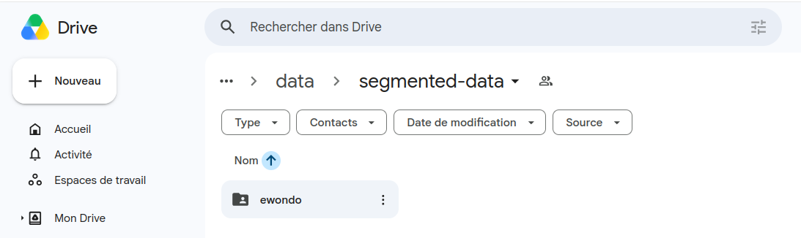

# Bible Scraper & Data Pre-processor

A modular toolkit designed to scrape audio and text versions of the Bible from [Bible.com](https://www.bible.com) and pre-process the data for ASR (Automatic Speech Recognition) or other NLP tasks.

## Project Structure

- `scraping/` : Node.js tool powered by **Playwright** to automatically download text and audio versions of chapters.
- `data-pre-processing/`: Python scripts to organize, clean, and map scraped data.
- `data-verification/`: Modular Python scripts to verify transcriptions against expected original text and log errors.
- `data-synchronisation/`: A modular synchronization package to sync local data with Google Drive, supporting upload, download, and mandatory verification gates.
- `utils/`: Helper scripts for data analysis and task distribution.

## Prerequisites

### System Tools
- **Node.js** (v14 or higher)
- **Python 3.10+** (v3.10 or higher recommended)
- **FFmpeg**: Required for audio processing (handling `.mp3` to `.wav` conversions, etc.).
- **wget**: Essential for downloading audio files via the scraping module.

### Installation

#### 1. Python Environment
It is recommended to use a virtual environment:
```bash
python -m venv .venv
source .venv/bin/activate  # Linux/macOS
# or
.venv\Scripts\activate     # Windows

pip install -r requirement.txt
```

#### 2. Scraping Module (Node.js)
```bash
cd scraping
npm install
npx playwright install chromium
```

## 1. Scraping Module

### Features
- **Dual Format**: Downloads both `.txt` (clean verses) and `.mp3` (audio) for every chapter.
- **Smart Organization**: Automatically groups files into nested folders: `data/<language>/<book>/<book_chapter>/`.
- **Targeted Scraping**: Configure specific books, starting chapters, or versions. Option to download only a single chapter.
- **Customizable Settings**: Extensive command-line arguments for dynamic scraping (`--language`, `--book`, `--chapter`, `--suffix`, `--text-only`, `--single-chapter`, `--download-folder`).
- **Continuous Mode**: Optional "Download Until End" mode to scrape entire books automatically.

### Usage
   ```bash
   # Start the scraper:
   node src/scrapping.js

   # You can also specify custom parameters:
   node src/scrapping.js --suffix original
   
   # Example: Download only the text for chapter 1 of Mark in Ewondo:
   node src/scrapping.js --language ewondo --book MRK --chapter 1 --text-only --single-chapter --suffix original

   # Example: Download to a custom folder:
   node src/scrapping.js --download-folder /path/to/custom/folder
   ```

### CLI Options Reference

| Argument | Type | Default | Description |
| :--- | :--- | :--- | :--- |
| `--language` | `str` | `french` | Language identifier (e.g., `french`, `ewondo`). <br>**Note on adding languages:** If you want to add support for a new language, you must visit [Bible.com](https://www.bible.com) to find the correct Bible version code (e.g. `NTE12`) and numeric version ID (e.g. `1854`), and add them to the version mappings inside [scrapping.js](scraping/src/scrapping.js#L39-L55). |
| `--book` | `str` | `MAT` | USFM book code to scrape (e.g., `MAT`, `MRK`, `LUK`, `JHN`). |
| `--chapter` | `int` | `1` | Starting chapter number. |
| `--suffix` | `str` | `""` | Optional suffix to append to the filename (e.g. `original`). |
| `--text-only` | `flag` | *None* | Disables downloading the audio file, fetching only the text transcription. |
| `--single-chapter` | `flag` | *None* | Restricts downloading to only the starting chapter rather than continuing until the end of the book. |
| `--download-folder` | `str` | `../data/<language>` | Path to the directory where scraped files will be saved. |

## 2. Data Pre-processing Module

### Scripts
- **[pre_process_verses.py](data-pre-processing/pre_process_verses.py)**: Cleans the scraped text files by merging multi-line verses and ensuring each verse starts on a new line with its number in brackets (e.g., `[1]`).
- **[generate_verses_folder.py](data-pre-processing/generate_verses_folder.py)** : Creates individual sub-folders for each verse (e.g., `V_1`, `V_2`) within each chapter folder, based on the verse numbers found in the text files.
- **[generate_utterance_file.py](data-pre-processing/generate_utterance_file.py)**: A monitoring script that watches the data directory for new `.wav` files (e.g., created during manual audio segmentation) and automatically generates matching empty `.txt` files for transcriptions.

### Usage
```bash
cd data-pre-processing
# 1. Map and copy French text to Ewondo folders
python main.py
# 2. Clean up verse formatting
python pre_process_verses.py --data_folder ../scraping/data/ewondo

# You can also process a specific chapter:
python pre_process_verses.py --book MAT --chapter MAT_1
# 3. Create verse sub-folders
python generate_verses_folder.py --data_folder ../scraping/data/ewondo
# 4. Monitor for new audio segments (run in background during segmentation)
python generate_utterance_file.py --data_folder ../scraping/data/ewondo
```

## 3. Data Verification Module

### Features
- **Automated Verification**: Compares segmented audio transcriptions against the original scraped text to ensure accuracy.
- **Exception Verification**: Fallback mechanism checking local `exception.txt` files to allow known orthographic discrepancies or alternative transcriptions.
- **Auto-Recovery**: Automatically downloads and pre-processes missing reference text from Bible.com if it's not found in the local data folder.
- **Modular Design**: Refactored into **[validator.py](data-verification/validator.py)** (core logic),  **[util.py](data-verification/util.py)** (helpers), and  **[verify_data.py](data-verification/verify_data.py)** (CLI entry point).
- **Granular Control**: Supports verification at the verse, chapter, book, or preprocessor assignment level.
- **Detailed Logging**: Logs all mismatches and missing files to `data-verification/logs/verification_errors.log`.
- **Exit Codes**: Returns `0` on success and `1` on failure, allowing integration into automated workflows.

### Exception Verification

When an audio segment transcription (`actual_clean`) doesn't match the expected scraped reference text (`expected_clean`), the verification system will check for a registered exception before failing.

1. **File Location**: The exceptions are defined in a file named `exception.txt` placed at the root of the language data directory (e.g. `{data_folder}/exception.txt` like `scraping/data/ewondo/exception.txt`).
2. **Format**: Each line in `exception.txt` must follow the format:
   ```text
   {chapter} V_{verse_number}: {exception_text}
   ```
   *Example:*
   ```text
   LUK_1 V_73: e sòṅ an gakani Abraham esya waan, na ayi bia vë na
   COL_1 V_5: asu afidi bënganyie mina a yob, a mingatari wog a ebug bëbëla mbëmbë foe ya
   ```
3. **Logic**:
   - The verification script parses `exception.txt` line by line looking for an entry matching the current `{chapter}` and `V_{verse_number}`.
   - If a match is found, it cleans the exception text by removing punctuation and extra spaces.
   - If the cleaned actual transcription matches the cleaned exception text, verification passes with a message:
     `Verse V_{verse_number} verification passed with exception!`
   - If no match is found or the texts still do not align, an `AssertionError` is raised.

### Usage
```bash
cd data-verification
# Verify a specific preprocessor's workload (requires assignment.json)
python verify_data.py --preprocessor pre_processor_1

# Verify a specific book
python verify_data.py --book MAT

# Verify multiple books
python verify_data.py --books MAT MRK

# Verify multiple books, and output results in JSON format
python verify_data.py --books MAT MRK --json

# Verify a specific chapter
python verify_data.py --book MAT --chapter MAT_1

# Verify multiple chapters
python verify_data.py --book MAT --chapters MAT_1 MAT_2

# Verify multiple chapters within a custom data directory
python verify_data.py --data_folder ../custom_data/ewondo --book MAT --chapters MAT_1 MAT_2

# Verify a specific verse
python verify_data.py --book MAT --chapter MAT_1 --verse V_1
```

## 4. Utilities Module

### Scripts
- **[data_statistics.py](utils/data_statistics.py)**: Analyzes scraped and processed dataset files to generate comprehensive statistics. It supports multiple modes of operations:
  - **Global Dataset Statistics**: Calls [get_statictics](utils/data_statistics.py#L13) to extract metrics (number of books, chapters, verses, and audio duration statistics) from raw scraped files, saving them to `{data_folder}/statistics.json`.
  - **Segmented Chapter Statistics**: Calls [get_segmented_chapter_statistics](utils/data_statistics.py#L122) to analyze segmented `.wav` files inside a specific chapter folder and generate `{chapter}_statistics.json`.
  - **Segmented Book Statistics**: Calls [get_segmented_book_statistics](utils/data_statistics.py#L157) to compile segment statistics for all chapters of a book, saving them to `{book}_statistics.json`.
  - **Segmented Books Statistics**: Calls [get_segmented_books_statistics](utils/data_statistics.py#L170) to compile segment statistics for a custom list of books, saving them to `{books_list}_statistics.json`.
  - **Preprocessor Workload Statistics**: Calls [get_segmented_preprocessor_data_statistics](utils/data_statistics.py#L220) to read `assignment.json` and generate workload statistics for a specific preprocessor, saving them to `{preprocessor_name}_statistics.json`.
- **[assigning_data_to_pre_pocessors.py](utils/assigning_data_to_pre_pocessors.py)**: Distributes the workload among a specified number of "pre-processors" by balancing the total audio duration assigned to each. It generates an `assignment.json` file.


*For a complete reference of the CLI parameters supported by this script and others, see the [Shared CLI Arguments Reference](#6-shared-cli-arguments-reference) section.*


### Usage
```bash
cd utils

# Generate global statistics for the entire dataset (default raw scraper statistics)
python data_statistics.py --data_folder ../scraping/data/ewondo

# Generate statistics for a specific book (e.g., MAT)
python data_statistics.py --data_folder ../scraping/data/ewondo --book MAT

# Generate statistics for a specific chapter (e.g., MAT_1)
python data_statistics.py --data_folder ../scraping/data/ewondo --book MAT --chapter MAT_1

# Generate statistics for multiple books (e.g., MAT and LUK)
python data_statistics.py --data_folder ../scraping/data/ewondo --books MAT LUK

# Generate statistics for a specific preprocessor workload
python data_statistics.py --data_folder ../scraping/data/ewondo --preprocessor pre_processor_1

# Assign data to 5 pre-processors
python assigning_data_to_pre_pocessors.py --data_folder ../scraping/data/ewondo --nbr_pre_processors 5
```

## 5. Data Synchronisation Module

### Features
- **Bidirectional Sync / Cloud Backup**: Synchronizes local data with Google Drive. Supports both uploading local work to Drive and downloading data from Drive to local folders.
- **Verification Gate**: Automated verification before synchronization.
- **Partial Sync**: **Smart synchronization logic** that skips individual verses that fail verification while still uploading those that pass.
- **Preprocessor Support**: Effortlessly synchronize or download an entire workload assigned to a specific preprocessor.
- **Granular Sync / Download**: Supports operations at the book, chapter, or verse level.
- **Dual Authentication**: Supports both **Service Accounts** and **OAuth2 User Authentication** (recommended to use your personal storage quota).
- **Headless Mode**: Special flag for authenticating on remote servers without browser access.
- **Modular Package**: Refactored into **[config.py](data-synchronisation/config.py)**, **[auth.py](data-synchronisation/auth.py)**, **[synchronizer.py](data-synchronisation/synchronizer.py)**, and **[synchronise_data.py](data-synchronisation/synchronise_data.py)**.

### Setup
1. **Create a Google Cloud Project:**
   - Go to the [Google Cloud Console](https://console.cloud.google.com/).
   - Create a new project (e.g., "Smart-Transcribe").
2. **Enable Google Drive API:**
   - Navigate to **APIs & Services > Library**.
   - Search for "Google Drive API" and click **Enable**.
3. **Configure OAuth Consent Screen (Required for OAuth2):**
   - Go to **APIs & Services > OAuth consent screen**.
   - Choose **External** and fill in the required app information.
   - **Test Users (Crucial):** Scroll down to "Test users" and add **every Gmail address** (yours and your collaborators') that will use the script. 
     - *Note:* If an email is not added here, the user will get an **"Error 403: access_denied"** when trying to log in.
   - **Note on Security Warning:** Since the app is not verified by Google, you will see a "Google hasn't verified this app" message during the first login. Click **Advanced** and then **Go to [Your Project Name] (unsafe)** to proceed.
4. **Obtain Credentials:**
   - **For `client-secret.json` (Personal Quota - Recommended):**
     - Go to **APIs & Services > Credentials**.
     - Click **Create Credentials > OAuth client ID**.
     - Select **Desktop app**, name it, and download the JSON.
     - Rename it to `client-secret.json` and place it in the `account/` folder.
   - **For `service-account.json` (Optional):**
     - Click **Create Credentials > Service Account**.
     - Follow the steps to create it, then go to the **Keys** tab of the new account.
     - Click **Add Key > Create new key (JSON)**.
     - Rename the downloaded file to `service-account.json` and place it in the `account/` folder.
5. **Configure Environment:**
   - Configure your target Drive folder in the `.env` file:
     ```env
     DRIVE_FOLDER_ID=your_folder_id_here
     ```
   - **Sharing:** Ensure the target Google Drive folder is **shared** with the email address of the Service Account (if used) or that your personal account has "Editor" access to it.

### Language Folder Mapping & Directory Structure

> [!IMPORTANT]
> Before launching the script to **download**, ensure that the last segment of the `--data_folder` path value matches exactly with the folder hosting your data on Google Drive. If they do not match, the execution will abort with:
>
> `Language folder '{last segment}' not found on Google Drive.`
>
> For example, in the illustration image below:
> - The parent folder on Google Drive is named `segmented-data` (whose folder ID is configured in your `.env` file under `DRIVE_FOLDER_ID`).
> - Directly inside this folder, the language data is hosted in a sub-folder named `ewondo`.
> - Therefore, if you want to download this language data, the last part of your `--data_folder` argument must be `ewondo` (e.g., `--data_folder ../scraping/data/ewondo`).
>
> 

### Usage
```bash
cd data-synchronisation

# Synchronize a specific preprocessor's workload (Verify then Sync)
python synchronise_data.py --preprocessor pre_processor_1

# Download a specific preprocessor's workload from Google Drive
python synchronise_data.py --preprocessor pre_processor_1 --download

# Synchronize a specific book
python synchronise_data.py --book MAT

# Download a specific book from Google Drive to local folder
python synchronise_data.py --book MAT --download

# Synchronize multiple books
python synchronise_data.py --books MAT MRK

# Download multiple books from Google Drive to local folder
python synchronise_data.py --books MAT MRK --download

# Synchronize a specific chapter
python synchronise_data.py --book MAT --chapter MAT_1

# Download a specific chapter from Google Drive
python synchronise_data.py --book MAT --chapter MAT_1 --download

# Synchronize multiple chapters
python synchronise_data.py --book MAT --chapters MAT_1 MAT_2

# Download multiple chapters from Google Drive
python synchronise_data.py --book MAT --chapters MAT_1 MAT_2 --download

# Synchronize a specific verse
python synchronise_data.py --book MAT --chapter MAT_1 --verse V_1

# Download a specific verse from Google Drive
python synchronise_data.py --book MAT --chapter MAT_1 --verse V_1 --download

# Skip verification gate (Force Sync)
python synchronise_data.py --book MAT --no-verify

# Synchronize on a remote server (SSH)
python synchronise_data.py --book MAT --headless
```

## 6. Shared CLI Arguments Reference

To maintain a consistent interface and avoid redundancy, all Python scripts in this toolkit leverage a shared argument parser defined in [utils/cli_args.py](utils/cli_args.py).

### Common Arguments
All scripts support the `--data_folder` argument, and specific scripts extend this to include granular data targeting options:

| Argument | Type | Default | Description |
| :--- | :--- | :--- | :--- |
| `--data_folder` | `str` | `../scraping/data/ewondo` | Path to the local data directory. |
| `--book` | `str` | `None` | Target a specific book (e.g., `MAT`). |
| `--books` | `list` | `None` | Target multiple books (e.g., `MAT MRK`). |
| `--chapter` | `str` | `None` | Target a specific chapter (e.g., `MAT_1`). Requires `--book`. |
| `--chapters` | `list` | `None` | Target multiple chapters (e.g., `MAT_1 MAT_2`). Requires `--book`. |
| `--verse` | `str` | `None` | Target a specific verse folder (e.g., `V_1`). |
| `--preprocessor`| `str` | `None` | Target a specific preprocessor workload assignment. |

### Script-Specific Parameter Matrix

The table below shows which standard and unique parameters are supported by each script:

| Script | Common Params Supported | Unique Parameters |
| :--- | :--- | :--- |
| **[pre_process_verses.py](data-pre-processing/pre_process_verses.py)** | `--data_folder`, `--book`, `--chapter` | *None* |
| **[generate_verses_folder.py](data-pre-processing/generate_verses_folder.py)** | `--data_folder` | *None* |
| **[generate_utterance_file.py](data-pre-processing/generate_utterance_file.py)** | `--data_folder` | *None* |
| **[verify_data.py](data-verification/verify_data.py)** | All common arguments | `--json`: Output verification errors as a JSON block. |
| **[synchronise_data.py](data-synchronisation/synchronise_data.py)** | All common arguments | `--headless`: SSH/console-mode authentication.<br>`--no-verify`: Skip verification gate before synchronization.<br>`--download`: Download from Google Drive instead of uploading. |
| **[data_statistics.py](utils/data_statistics.py)** | `--data_folder`, `--book`, `--chapter`, `--preprocessor` | `--books`: space-separated list of books to compile metrics (mutually exclusive with `--book` and `--preprocessor`). |
| **[assigning_data_to_pre_pocessors.py](utils/assigning_data_to_pre_pocessors.py)**| `--data_folder` | `--nbr_pre_processors` (default `5`): Total partitions. |

## Folder Structure After Processing
```
scraping/data/
├── ewondo/
│   └── MAT/
│       └── MAT_1/
│           ├── MAT_1.mp3      (Full Chapter Audio)
│           ├── MAT_1.txt      (Cleaned Ewondo Text)
│           ├── MAT_1_fr.txt   (French Text - for alignment)
│           ├── V_1/           (Verse-specific folder)
│           │   ├── V_1_UTT_1.wav  (Segmented Audio)
│           │   └── V_1_UTT_1.txt  (Utterance Transcription)
│           └── V_2/           ...
└── french/
    └── MAT/
        └── MAT_1/
            └── MAT_1.txt
```

## Troubleshooting

- **Timeout Error**: Might be due to slow page loads or cookie consent popups.
- **Selector Changes**: The scraper depends on Bible.com's CSS classes. If the site layout changes, update selectors in `src/scrapping.js` or `src/textDownloader.js`.
- **wget not found**: Ensure `wget` is available in your PATH.
- **OAuth 2.0 Access Denied (Error 403: access_denied)**: Make sure the Gmail address you are authenticating with is added to the "Test users" list in your Google Cloud Project's OAuth consent screen config.
- **Google hasn't verified this app warning**: This is normal for unverified development apps. Click **Advanced** and then **Go to [Project Name] (unsafe)** to bypass.
- **Storage Quota Exceeded (Error 403: storageQuotaExceeded)**: Service accounts have a very limited shared storage. Configure and use OAuth2 with `client-secret.json` to utilize your personal account's Google Drive storage instead.
- **Drive Folder ID Not Found or Access Error**: Ensure that `DRIVE_FOLDER_ID` is set correctly in your `.env` file, and that the target Google Drive folder is shared with the account executing the script (e.g. Editor permission).
- **Verification Failures During Upload**: If synchronization is blocked because of local text validation failures, you can bypass the checks using the `--no-verify` flag.
